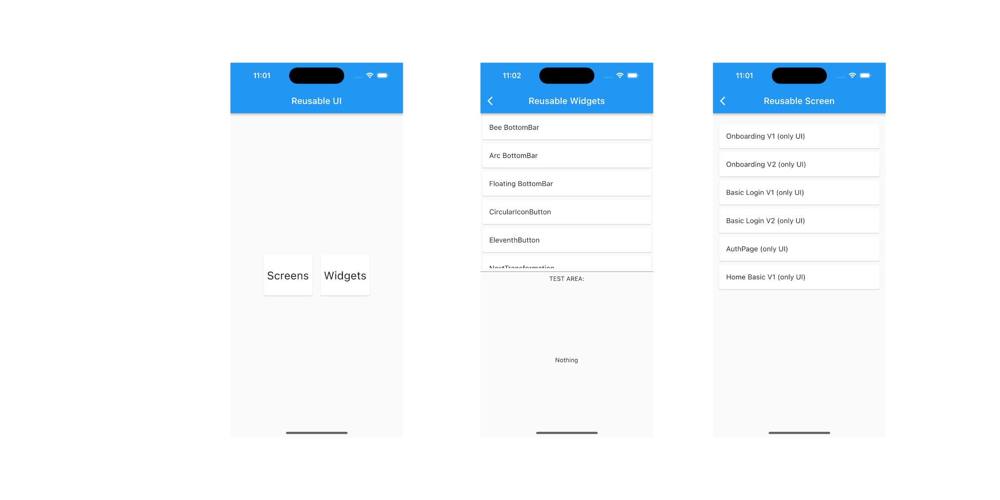

# Reusable ui flutter

This project contains different widgets and views created with Flutter, the goal is to have a quick way to start an app.

Many of these views are taken from personal projects and/or tutorials. You can find more cool flutter UI examples in this project: [flutter_ui_challenges][flutter_ui_challenges].

Other projects you can try:
- TaleDrawer: [tale_drawer]
- Rolling Switch: [rolling]

You can start the app, and test every widget of view:

## Screens

| TYPE      | NAME                                                 | REF                               | 
| --------- | ---------------------------------------------------- | --------------------------------- |
| Screen    | [AuthPage][AuthPage]                                 | ![][AuthPage_REF]                 |
| Screen    | [HomePage1][HomePage1]                               | ![][HomePage1_REF]                |
| Screen    | [Loginpage1][Loginpage1]                             | ![][Loginpage1_REF]               |
| Screen    | [Loginpage2][Loginpage2]                             | ![][Loginpage2_REF]               |
| Screen    | [Onboarding1][Onboarding1]                           | ![][Onboarding1_REF]              |
| Screen    | [Onboarding2][Onboarding2]                           | ![][Onboarding2_REF]              |

## Widgets
| TYPE      | NAME                                                 | REF                               |
| --------- | ---------------------------------------------------- | --------------------------------- |
| Widget    | [BeeBottomBar][BeeBottomBar]                         | ![][BeeBottomBar_REF]             |
| Widget    | [ArcBottomBar][ArcBottomBar]                         | ![][ArcBottomBar_REF]             |
| Widget    | [FloatingBottomBar][FloatingBottomBar]               | ![][FloatingBottomBar_REF]        |
| Widget    | [CircularIconButton][CircularIconButton]             | ![][CircularIconButton_REF]       |
| Widget    | [EleventhButton][EleventhButton]                     | ![][EleventhButton_REF]           |
| Widget    | [NextTransformationButton][NextTransformationButton] | ![][NextTransformationButton_REF] |
| Widget    | [FlipCardWidget][FlipCardWidget]                     | ![][FlipCardWidget_REF]           |
| Widget    | [RightTriangleClipper][RightTriangleClipper]         | ![][RightTriangleClipper_REF]     |
| Widget    | [MultiFab][MultiFab]                                 | ![][MultiFab_REF]                 |
| Widget    | [RowFab][RowFab]                                     | ![][RowFab_REF]                   |
| Widget    | [InputTextWidget][InputTextWidget]                   | ![][InputTextWidget_REF]          |
| Widget    | [OutlineTextInput][OutlineTextInput]                 | ![][OutlineTextInput_REF]         |
| Widget    | [PointsLoader][PointsLoader]                         | ![][PointsLoader_REF]             |
| Widget    | [BlurredContainer][BlurredContainer]                 | ![][BlurredContainer_REF]         |
| Widget    | [BounceWrapper][BounceWrapper]                       | ![][BounceWrapper_REF]            |
| Widget    | [CTABar][CTABar]                                     | ![][CTABar_REF]                   |
| Widget    | [LikeBar][LikeBar]                                   | ![][LikeBar_REF]                  |
| Widget    | [SliderDots][SliderDots]                             | ![][SliderDots_REF]               |
| Widget    | [FloatingOptions][FloatingOptions]                   | ![][FloatingOptions_REF]          |
| Widget    | [SkipTopBar][SkipTopBar]                             | ![][SkipTopBar_REF]               |

## Misc
| TYPE      | NAME                                                 | REF  | 
| --------- | ---------------------------------------------------- | -----|
| Extension | [ResponsiveContext][ResponsiveContext]               | - |
| Controller| [CustomController][CustomController]                 | - |

## How to contribute
This is an experimental project.

- Propose more widgets solutions
- Create more widgets, screens solutions
- Report errors
- Improve the documentation.
- Share with other persons

## How to use
You can start the app and test every screen and widget.

If you want to include a widget into your project, you can **Copy & Paste** the solution and modify the specific things for your project.

## TODO
- Support [MASON](https://verygood.ventures/blog/code-generation-with-mason) to copy&paste widgets

## Contributors

- [James Cardona](https://github.com/jamescardona11)
- [Juan Quintero](https://github.com/juequinterore)

You are welcome to contribute :3

Flutter is a game-changing technology that will revolutionize not just development, but software itself. A big thank you to the Flutter team for building such an amazing platform 💙 

## License

    MIT License
    Copyright (c) 2022 James Cardona
    
    Permission is hereby granted, free of charge, to any person obtaining a copy
    of this software and associated documentation files (the "Software"), to deal
    in the Software without restriction, including without limitation the rights
    to use, copy, modify, merge, publish, distribute, sublicense, and/or sell
    copies of the Software, and to permit persons to whom the Software is
    furnished to do so, subject to the following conditions:
    
    The above copyright notice and this permission notice shall be included in all
    copies or substantial portions of the Software.
    
    THE SOFTWARE IS PROVIDED "AS IS", WITHOUT WARRANTY OF ANY KIND, EXPRESS OR
    IMPLIED, INCLUDING BUT NOT LIMITED TO THE WARRANTIES OF MERCHANTABILITY,
    FITNESS FOR A PARTICULAR PURPOSE AND NONINFRINGEMENT. IN NO EVENT SHALL THE
    AUTHORS OR COPYRIGHT HOLDERS BE LIABLE FOR ANY CLAIM, DAMAGES OR OTHER
    LIABILITY, WHETHER IN AN ACTION OF CONTRACT, TORT OR OTHERWISE, ARISING FROM,
    OUT OF OR IN CONNECTION WITH THE SOFTWARE OR THE USE OR OTHER DEALINGS IN THE
    SOFTWARE.

[//]: #Ref
[flutter_ui_challenges]: https://github.com/jamescardona11/flutter_ui_challenges
[tale_drawer]: https://github.com/TKMonkey/tale_drawer
[rolling]: https://github.com/jamescardona11/rolling_switch

[AuthPage]: https://github.com/jamescardona11/starter_kit_flutter/blob/main/reusable_ui_flutter/lib/screens/auth_page
[AuthPage_REF]: https://raw.githubusercontent.com/jamescardona11/starter_kit_flutter/main/reusable_ui_flutter/lib/screens/auth_page/auth_page.png

[HomePage1]: https://github.com/jamescardona11/starter_kit_flutter/blob/main/reusable_ui_flutter/lib/screens/home_page_1
[HomePage1_REF]: https://raw.githubusercontent.com/jamescardona11/starter_kit_flutter/main/reusable_ui_flutter/lib/screens/home_page_1/home_page_1.png

[Loginpage1]: https://github.com/jamescardona11/starter_kit_flutter/blob/main/reusable_ui_flutter/lib/screens/login_page_1
[Loginpage1_REF]: https://raw.githubusercontent.com/jamescardona11/starter_kit_flutter/main/reusable_ui_flutter/lib/screens/login_page_1/login_page_1.png

[Loginpage2]: https://github.com/jamescardona11/starter_kit_flutter/blob/main/reusable_ui_flutter/lib/screens/login_page_2
[Loginpage2_REF]: https://raw.githubusercontent.com/jamescardona11/starter_kit_flutter/main/reusable_ui_flutter/lib/screens/login_page_2/login_page_2.png

[Onboarding1]: https://github.com/jamescardona11/starter_kit_flutter/blob/main/reusable_ui_flutter/lib/screens/onboarding_1
[Onboarding1_REF]: https://raw.githubusercontent.com/jamescardona11/starter_kit_flutter/main/reusable_ui_flutter/lib/screens/onboarding_1/onboarding_1.png

[Onboarding2]: https://github.com/jamescardona11/starter_kit_flutter/blob/main/reusable_ui_flutter/lib/screens/onboarding_2
[Onboarding2_REF]: https://raw.githubusercontent.com/jamescardona11/starter_kit_flutter/main/reusable_ui_flutter/lib/screens/onboarding_2/onboarding_2.png

[ResponsiveContext]: https://github.com/jamescardona11/starter_kit_flutter/blob/main/reusable_ui_flutter/lib/config/responsive_extension.dart
[CustomController]: https://github.com/jamescardona11/starter_kit_flutter/blob/main/reusable_ui_flutter/lib/widgets/widget_controller/custom_controller.dart

[BeeBottomBar]: https://github.com/jamescardona11/starter_kit_flutter/blob/main/reusable_ui_flutter/lib/widgets/bottom_bar/bee_bottom_bar/bee_bottom_bar.dart
[BeeBottomBar_REF]: https://raw.githubusercontent.com/jamescardona11/starter_kit_flutter/main/reusable_ui_flutter/lib/widgets/bottom_bar/bee_bottom_bar.gif

[ArcBottomBar]: https://github.com/jamescardona11/starter_kit_flutter/blob/main/reusable_ui_flutter/lib/widgets/bottom_bar/arc_bottom_bar.dart
[ArcBottomBar_REF]: https://raw.githubusercontent.com/jamescardona11/starter_kit_flutter/main/reusable_ui_flutter/lib/widgets/bottom_bar/arc_bottom_bar.gif

[FloatingBottomBar]: https://github.com/jamescardona11/starter_kit_flutter/blob/main/reusable_ui_flutter/lib/widgets/bottom_bar/floating_bottom_bar.dart
[FloatingBottomBar_REF]: https://raw.githubusercontent.com/jamescardona11/starter_kit_flutter/main/reusable_ui_flutter/lib/widgets/bottom_bar/floating_bottom_bar.png

[CircularIconButton]: https://github.com/jamescardona11/starter_kit_flutter/blob/main/reusable_ui_flutter/lib/widgets/buttons/circular_iconbutton_widget.dart
[CircularIconButton_REF]: https://raw.githubusercontent.com/jamescardona11/starter_kit_flutter/main/reusable_ui_flutter/lib/widgets/buttons/circular_iconbutton_widget.png

[EleventhButton]: https://github.com/jamescardona11/starter_kit_flutter/blob/main/reusable_ui_flutter/lib/widgets/buttons/eleventh_button_widget.dart
[EleventhButton_REF]: https://raw.githubusercontent.com/jamescardona11/starter_kit_flutter/main/reusable_ui_flutter/lib/widgets/buttons/eleventh_button_widget.png

[NextTransformationButton]: https://github.com/jamescardona11/starter_kit_flutter/blob/main/reusable_ui_flutter/lib/widgets/buttons/next_transformation_button.dart
[NextTransformationButton_REF]: https://raw.githubusercontent.com/jamescardona11/starter_kit_flutter/main/reusable_ui_flutter/lib/widgets/buttons/next_transformation_button.gif

[FlipCardWidget]: https://github.com/jamescardona11/starter_kit_flutter/blob/main/reusable_ui_flutter/lib/widgets/card/flipcard_widget.dart
[FlipCardWidget_REF]: https://raw.githubusercontent.com/jamescardona11/starter_kit_flutter/main/reusable_ui_flutter/lib/widgets/card/flipcard_widget.gif

[RightTriangleClipper]: https://github.com/jamescardona11/starter_kit_flutter/blob/main/reusable_ui_flutter/lib/widgets/clipper/right_triangle_clipper.dart
[RightTriangleClipper_REF]: https://raw.githubusercontent.com/jamescardona11/starter_kit_flutter/main/reusable_ui_flutter/lib/widgets/clipper/right_triangle_clipper.png

[MultiFab]: https://github.com/jamescardona11/starter_kit_flutter/blob/main/reusable_ui_flutter/lib/widgets/fab/multi_fab.dart
[MultiFab_REF]: https://raw.githubusercontent.com/jamescardona11/starter_kit_flutter/main/reusable_ui_flutter/lib/widgets/fab/multi_fab.gif

[RowFab]: https://github.com/jamescardona11/starter_kit_flutter/blob/main/reusable_ui_flutter/lib/widgets/fab/row_fab.dart
[RowFab_REF]: https://raw.githubusercontent.com/jamescardona11/starter_kit_flutter/main/reusable_ui_flutter/lib/widgets/fab/row_fab.png

[InputTextWidget]: https://github.com/jamescardona11/starter_kit_flutter/blob/main/reusable_ui_flutter/lib/widgets/input/input_text_widget.dart
[InputTextWidget_REF]: https://raw.githubusercontent.com/jamescardona11/starter_kit_flutter/main/reusable_ui_flutter/lib/widgets/input/input_text_widget.png

[OutlineTextInput]: https://github.com/jamescardona11/starter_kit_flutter/blob/main/reusable_ui_flutter/lib/widgets/input/outline_input_text_widget.dart
[OutlineTextInput_REF]: https://raw.githubusercontent.com/jamescardona11/starter_kit_flutter/main/reusable_ui_flutter/lib/widgets/input/outline_input_text_widget.png

[PointsLoader]: https://github.com/jamescardona11/starter_kit_flutter/blob/main/reusable_ui_flutter/lib/widgets/loaders/points_loader.dart
[PointsLoader_REF]: https://raw.githubusercontent.com/jamescardona11/starter_kit_flutter/main/reusable_ui_flutter/lib/widgets/loaders/points_loader.gif

[BlurredContainer]: https://github.com/jamescardona11/starter_kit_flutter/blob/main/reusable_ui_flutter/lib/widgets/misc/blurred_container.dart
[BlurredContainer_REF]: https://raw.githubusercontent.com/jamescardona11/starter_kit_flutter/main/reusable_ui_flutter/lib/widgets/misc/blurred_container.png

[BounceWrapper]: https://github.com/jamescardona11/starter_kit_flutter/blob/main/reusable_ui_flutter/lib/widgets/misc/bounce_wrapper.dart
[BounceWrapper_REF]: https://raw.githubusercontent.com/jamescardona11/starter_kit_flutter/main/reusable_ui_flutter/lib/widgets/misc/bounce_wrapper.gif

[CTABar]: https://github.com/jamescardona11/starter_kit_flutter/blob/main/reusable_ui_flutter/lib/widgets/misc/cta_bar.dart
[CTABar_REF]: https://raw.githubusercontent.com/jamescardona11/starter_kit_flutter/main/reusable_ui_flutter/lib/widgets/misc/cta_bar.png

[LikeBar]: https://github.com/jamescardona11/starter_kit_flutter/blob/main/reusable_ui_flutter/lib/widgets/misc/like_bar.dart
[LikeBar_REF]: https://raw.githubusercontent.com/jamescardona11/starter_kit_flutter/main/reusable_ui_flutter/lib/widgets/misc/like_bar.png

[SliderDots]: https://github.com/jamescardona11/starter_kit_flutter/blob/main/reusable_ui_flutter/lib/widgets/slider/slider_dots.dart
[SliderDots_REF]: https://raw.githubusercontent.com/jamescardona11/starter_kit_flutter/main/reusable_ui_flutter/lib/widgets/slider/slider_dots.gif

[FloatingOptions]: https://github.com/jamescardona11/starter_kit_flutter/blob/main/reusable_ui_flutter/lib/widgets/topbar/appbar_option.dart
[FloatingOptions_REF]: https://raw.githubusercontent.com/jamescardona11/starter_kit_flutter/main/reusable_ui_flutter/lib/widgets/topbar/appbar_option.gif

[SkipTopBar]: https://github.com/jamescardona11/starter_kit_flutter/blob/main/reusable_ui_flutter/lib/widgets/topbar/skip_top_bar.dart
[SkipTopBar_REF]: https://raw.githubusercontent.com/jamescardona11/starter_kit_flutter/main/reusable_ui_flutter/lib/widgets/topbar/skip_top_bar.gif