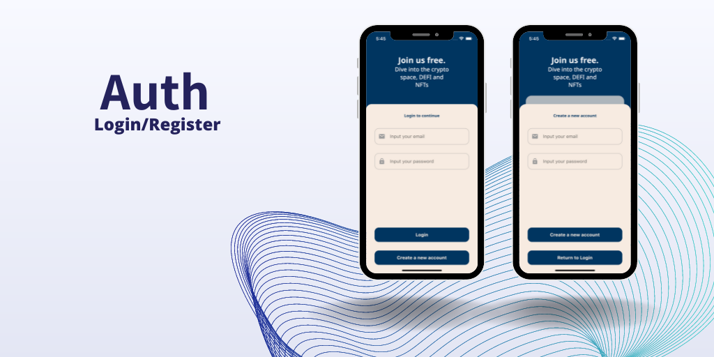

# Auth Screen

#### External dependencies
- flutter_keyboard_visibility: https://pub.dev/packages/flutter_keyboard_visibility
- google_fonts: https://pub.dev/packages/google_fonts

#### In this project dependencies
- [ResponsiveContext]
- [EleventhButton]
- [InputTextWidget]

[//]: #Ref
[ResponsiveContext]: https://github.com/jamescardona11/starter_kit_flutter/blob/main/reusable_ui_flutter/lib/config/responsive_extension.dart

[EleventhButton]: https://github.com/jamescardona11/starter_kit_flutter/blob/main/reusable_ui_flutter/lib/widgets/buttons/eleventh_button_widget.dart

[InputTextWidget]: https://github.com/jamescardona11/starter_kit_flutter/blob/main/reusable_ui_flutter/lib/widgets/input/input_text_widget.dart