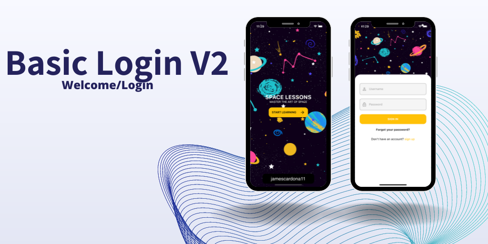

# Login 2 Screen

#### In this project dependencies
- [EleventhButton]
- [OutlineTextInput]

[//]: #Ref
[ResponsiveContext]: https://github.com/jamescardona11/starter_kit_flutter/blob/main/reusable_ui_flutter/lib/config/responsive_extension.dart

[EleventhButton]: https://github.com/jamescardona11/starter_kit_flutter/blob/main/reusable_ui_flutter/lib/widgets/buttons/eleventh_button_widget.dart

[OutlineTextInput]: https://github.com/jamescardona11/starter_kit_flutter/blob/main/reusable_ui_flutter/lib/widgets/input/outline_input_text_widget.dart