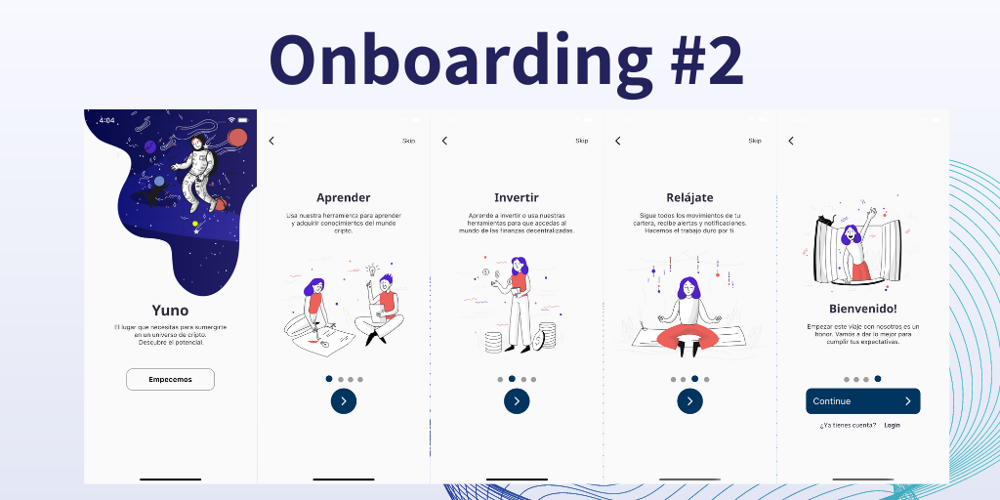

# Onboarding 2 Screen

#### External dependencies
- google_fonts: https://pub.dev/packages/google_fonts

#### In this project dependencies
- [SkipTopBar]
- [NextTransformationButton]
- [SliderDots]
- [EleventhButton]

[//]: #Ref

[EleventhButton]: https://github.com/jamescardona11/starter_kit_flutter/blob/main/reusable_ui_flutter/lib/widgets/buttons/eleventh_button_widget.dart

[NextTransformationButton]: https://github.com/jamescardona11/starter_kit_flutter/blob/main/reusable_ui_flutter/lib/widgets/buttons/next_transformation_button.dart

[SliderDots]: https://github.com/jamescardona11/starter_kit_flutter/blob/main/reusable_ui_flutter/lib/widgets/slider/slider_dots.dart

[SkipTopBar]: https://github.com/jamescardona11/starter_kit_flutter/blob/main/reusable_ui_flutter/lib/widgets/topbar/skip_top_bar.dart