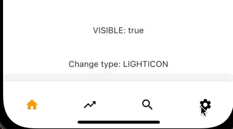
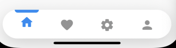
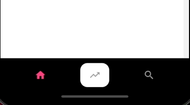

# Bottom bar


### ArcBottomBar


```
bottomNavigationBar: ArcBottomBar(
  items: [
    BottomElevenItem(
      activeColor: Colors.orange,
      label: 'Home',
      icon: Icons.home,
    ),
    BottomElevenItem(
      activeColor: Colors.red,
      label: 'Trending',
      icon: Icons.trending_up,
    ),
    BottomElevenItem(
      activeColor: Colors.green,
      label: 'Search',
      icon: Icons.search,
    ),
    BottomElevenItem(
      activeColor: Colors.brown,
      label: 'Settings',
      icon: Icons.settings,
    ),
  ],
  onItemSelected: (index) {
    print(index);
  },
)
```


### FloatingBottomBar

```
bottomNavigationBar: FloatingBottomBar(
  items: [
    BottomElevenItem(
      icon: Icons.home_rounded,
    ),
    BottomElevenItem(
      icon: Icons.favorite_rounded,
    ),
    BottomElevenItem(
      icon: Icons.settings_rounded,
    ),
    BottomElevenItem(
      icon: Icons.person_rounded,
    ),
  ],
)
```


### BeeBottomBar


```
bottomNavigationBar: BeeBottomBar(
  items: [
    BottomElevenItem(
      label: 'Home',
      icon: Icons.home,
    ),
    BottomElevenItem(
      label: 'Trending',
      icon: Icons.trending_up,
    ),
    BottomElevenItem(
      label: 'Search',
      icon: Icons.search,
    ),
    // BottomElevenItem(
    //   label: 'Settings',
    //   icon: Icons.settings,
    // ),
  ],
),
```