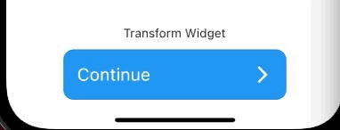

# Buttons


###  CircularIconButton

```
CircularIconButton(
  icon: Icons.near_me,
  onPressed: () {},
)
```


###  NextTransformationButton


```
NextTransformationButton(
  onNextPressed: () {
    
  },
  onTransformPressed: () {},
  topWidget: const Padding(
    padding: EdgeInsets.only(
      top: 10,
      bottom: 10,
    ),
    child: Text('Transform Widget'),
  ),
)
```


### EleventhButton

```
EleventhButton(
  label: 'Button',
  primaryColor: Colors.black,
  accentColor: Colors.white,
  onPressed: () {},
),

EleventhButton(
  label: 'Button',
  fill: false,
  primaryColor: Colors.black,
  accentColor: Colors.white,
  onPressed: () {},
)
```