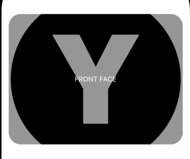

# Card


### FlipCardWidget

```
FlipCardWidget(
  height: 200,
  width: 400,
  controllerFlipCard: animationController,
  background: BackgroundConfig(
    image: const AssetImage('assets/logo.png'),
    borderRadius: BorderRadius.circular(25),
  ),
  frontFaceWidget: const Center(
    child:
        Text('FRONT FACE', style: TextStyle(color: Colors.white)),
  ),
  backFaceWidget: const Center(
    child: Text('BACK FACE', style: TextStyle(color: Colors.white)),
  ),
)
```