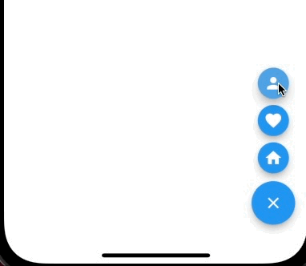
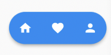

# Fab


### MultiFab



```
floatingActionButton: MultiFab(
  items: [
    FabElevenItem.multi(
      onPressed: () {},
      icon: Icon(Icons.home, color: Colors.white),
    ),
    FabElevenItem.multi(
      onPressed: () {},
      icon: Icon(Icons.favorite, color: Colors.white),
    ),
    FabElevenItem.multi(
      onPressed: () {},
      icon: Icon(Icons.person, color: Colors.white),
    ),
  ],
)
```


### RowFab

```
floatingActionButton: RowFab(
  items: [
    FabElevenItem.row(
      onPressed: () {},
      icon: const Icon(
        Icons.home,
        color: Colors.white,
      ),
    ),
    FabElevenItem.row(
      onPressed: () {},
      icon: const Icon(
        Icons.favorite,
        color: Colors.white,
      ),
    ),
    FabElevenItem.row(
      onPressed: () {},
      icon: const Icon(
        Icons.person,
        color: Colors.white,
      ),
    ),
  ],
  color: Colors.pinkAccentAccent,
  elevation: 4,
  // heroTag: 'aswdw',
),
```