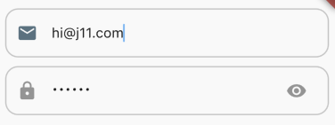
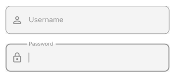

# Input Widgets


### InputTextWidget


```
InputTextWidget(
  hint: 'Enter your email',
  leadingIcon: Icons.email,
  onChanged: (value) {},
)
```


### OutlineTextInput

```
OutlineTextInput(
  label: 'Username',
  leadingIcon: Icons.person_outline,
  iconColor: Colors.black,
  cursorColor: Colors.black38,
)
```