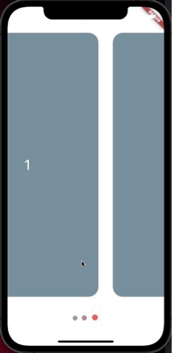

# Slider


### SliderDots

```
SliderDots(
  totalSlides: 3,
  controller: controller,
  accentColor: Colors.grey,
  dotsSize: 12,
  dotsSpace: 5,
  primaryColor: Colors.pinkAccent,
  secondaryDotsSize: 15,
)
```